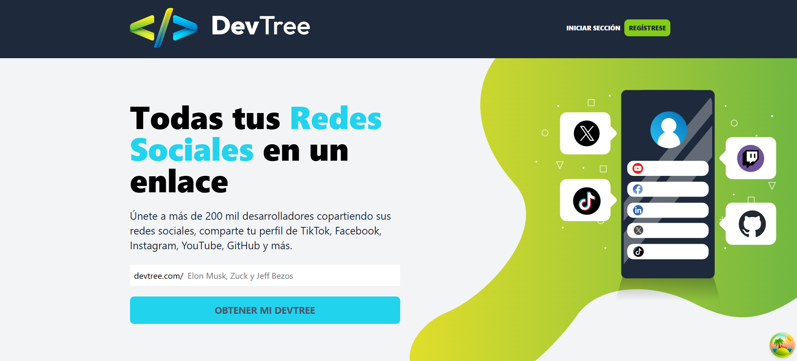

# backend DevTree

    

Este es un proyecto de API RESTful robusto y escalable, construido con Express.js y TypeScript, diseñado para servir como el backend de la aplicación DevTree. Proporciona una gestión completa de usuarios, autenticación segura basada en JWT, y una integración fluida con MongoDB para la persistencia de datos y Cloudinary para la gestión de archivos multimedia.

 

## 🚀 Características Principales

*   **API RESTful:** Conjunto de endpoints bien estructurados para la interacción con los recursos del backend.
*   **Autenticación de Usuarios:** Sistema de autenticación seguro basado en JSON Web Tokens (JWT) y `bcryptjs` para el hashing de contraseñas.
*   **Validación de Entradas:** Utiliza `express-validator` para garantizar la integridad y seguridad de los datos recibidos.
*   **Gestión de Archivos Multimedia:** Integración con Cloudinary para el almacenamiento, optimización y entrega de imágenes y otros archivos.
*   **Persistencia de Datos:** Conexión a MongoDB a través de Mongoose para una gestión de datos eficiente y flexible.
*   **Diseño Modular:** Código organizado en módulos (`config`, `middleware`, `models`, `handlers`, `utils`) para facilitar la mantenibilidad y escalabilidad.
*   **Configuración Basada en Entorno:** Gestión de variables de entorno para una configuración flexible y segura.

## 📋 Requisitos Previos

Antes de comenzar, asegúrate de tener instalado lo siguiente:

*   **Node.js** (versión 14 o superior)
*   **npm** (viene con Node.js)
*   **MongoDB** (instancia local o remota, por ejemplo, MongoDB Atlas)
*   Una cuenta de **Cloudinary** (para la gestión de archivos)

## 🛠️ Instalación

Sigue estos pasos para configurar y ejecutar el proyecto localmente:

1.  **Clona el repositorio:**
    ```bash
    git clone https://github.com/alejav0240/Devtree-Backend.git
    cd Devtree-Backend
    ```

2.  **Instala las dependencias:**
    ```bash
    npm install
    ```

3.  **Configura las variables de entorno:**
    Crea un archivo `.env` en la raíz del proyecto y añade las siguientes variables:

    ```env
    PORT=4000
    DATABASE_URL=mongodb://localhost:27017/devtree_db # O tu URL de MongoDB Atlas
    JWT_SECRET=tu_secreto_jwt_muy_seguro
    CLOUD_NAME=tu_cloud_name_cloudinary
    API_KEY=tu_api_key_cloudinary
    API_SECRET=tu_api_secret_cloudinary
    CORS_ORIGIN=* # O la URL de tu frontend, ej: http://localhost:3000
    ```

    *Asegúrate de reemplazar los valores de ejemplo con tus propias credenciales y configuraciones.*

4.  **Compila el código TypeScript (para producción):**
    ```bash
    npm run build
    ```

## 🚀 Uso

### Modo Desarrollo

Para iniciar el servidor en modo desarrollo con recarga automática:```bash
npm run dev
```

El servidor se ejecutará en `http://localhost:PORT` (por defecto `http://localhost:4000`).

### Modo Producción

Para iniciar el servidor compilado:```bash
npm start
```

### Ejemplos de Endpoints (Rutas Comunes)

A continuación, se presentan ejemplos de cómo interactuar con la API. Recuerda que los endpoints exactos pueden variar; consulta `src/router.ts` y los archivos de `handlers` para la definición precisa.

**Autenticación de Usuario:**

*   **POST /api/auth/register**
    ```json
    {
        "name": "John Doe",
        "email": "john.doe@example.com",
        "password": "securepassword123"
    }
    ```
*   **POST /api/auth/login**
    ```json
    {
        "email": "john.doe@example.com",
        "password": "securepassword123"
    }
    ```
    *Retorna un JWT para usar en futuras solicitudes autenticadas.*

**Usuario Autenticado:**

*   **GET /api/auth/me** (Requiere JWT en el encabezado `Authorization: Bearer <token>`)
    *Obtiene la información del usuario actualmente autenticado.*

**Ejemplo de Subida de Archivos (Cloudinary):**

*   **POST /api/upload** (Requiere JWT y un archivo en el cuerpo de la solicitud, ej: `multipart/form-data`)
    *Sube una imagen a Cloudinary y retorna la URL.*

## 📂 Estructura del Proyecto
```
Devtree-Backend/
├── src/
│   ├── config/             # Archivos de configuración (DB, Cloudinary, CORS)
│   │   ├── cloudinary.ts
│   │   ├── cors.ts
│   │   └── db.ts
│   ├── handlers/           # Lógica de negocio para cada endpoint
│   │   └── index.ts
│   ├── middleware/         # Middlewares personalizados (autenticación, validación)
│   │   ├── auth.ts
│   │   └── validation.ts
│   ├── models/             # Definiciones de esquemas de Mongoose (ej: User)
│   │   └── User.ts
│   ├── utils/              # Utilidades varias (JWT, helpers de autenticación)
│   │   ├── auth.ts
│   │   └── jwt.ts
│   ├── index.ts            # Punto de entrada principal de la aplicación
│   ├── router.ts           # Definición de todas las rutas de la API
│   └── server.ts           # Configuración e inicialización del servidor Express
├── README.md               # Este archivo
├── package-lock.json
├── package.json            # Metadatos del proyecto y dependencias
└── tsconfig.json           # Configuración de TypeScript
```


## 💻 Tecnologías Utilizadas

*   **TypeScript**
*   **Node.js**
*   **Express.js**
*   **MongoDB** (con Mongoose)
*   **Cloudinary**
*   **express-validator**
*   **jsonwebtoken**
*   **bcryptjs**
*   **cors**
*   **dotenv**